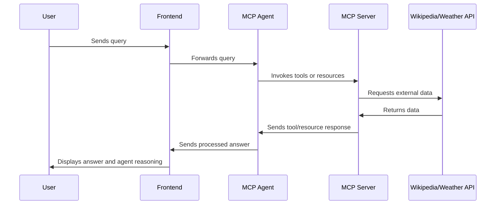

# MCP RAG Agent Chat

An interactive Streamlit application featuring a conversational agent based on MCP (Model Context Protocol) for retrieval-augmented generation (RAG). It leverages LangGraph and MCP protocol to integrate dynamic tools, external resources, and customizable prompts.

## Overview

This application enables users to chat with an intelligent agent capable of executing tools such as Wikipedia search, weather forecast retrieval, and web content extraction. The agent combines large language model (LLM) reasoning with retrieval from in-memory indexed resources to enhance responses.

## Architecture and Workflow

The system consists of:

- **Streamlit Frontend** ([`app.py`](app.py)): User interface for chatting with the agent, displaying available tools, resources, and prompts.
- **MCP Server** ([`mcp_server.py`](mcp_server.py)): Defines tools (e.g., Wikipedia, weather), resources, and prompts exposed via MCP.
- **MCP Agent Core** ([`rag_core.py`](rag_core.py)): Implements the RAG agent using LangChain, LangGraph, and a stdio MCP client.
- **Utility Module** ([`utils.py`](utils.py)): Helper functions for geocoding, weather code decoding, web scraping, and data conversions.

The communication flow follows the MCP protocol: the client sends queries to the agent, which can call external tools and retrieve relevant indexed documents to produce enhanced answers.

### Sequence Diagram

## Key Features
- **Multi-turn conversational interaction**

- **Dynamic usage of tools** such as Wikipedia search and weather forecast retrieval

- Displays **internal agent reasoning** (LLM thought process), if any

- Sidebar listing available tools, resources, and prompts for easy selection

- **In-memory indexing** of resources for fast retrieval

## Limitations
- Tools and resources are limited to the implemented examples (Wikipedia, weather).

- In-memory resource indexing is not persisted across restarts.
